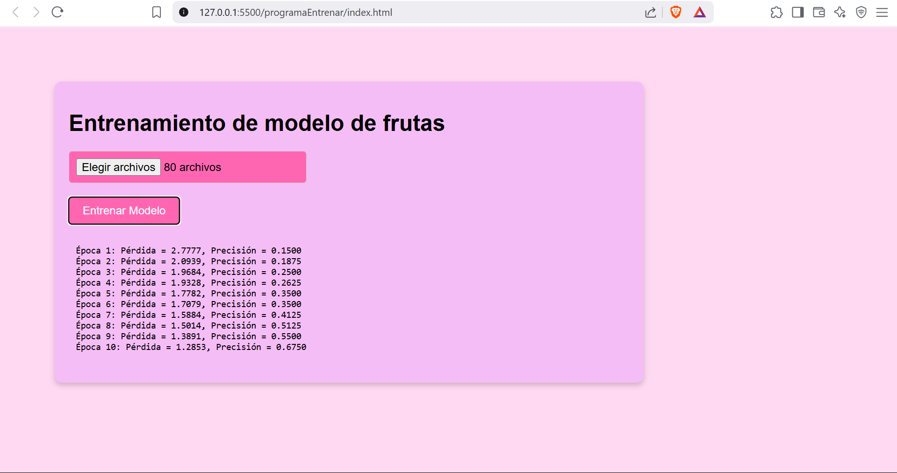
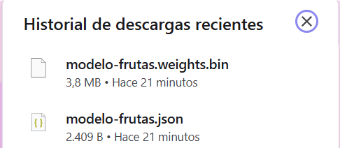
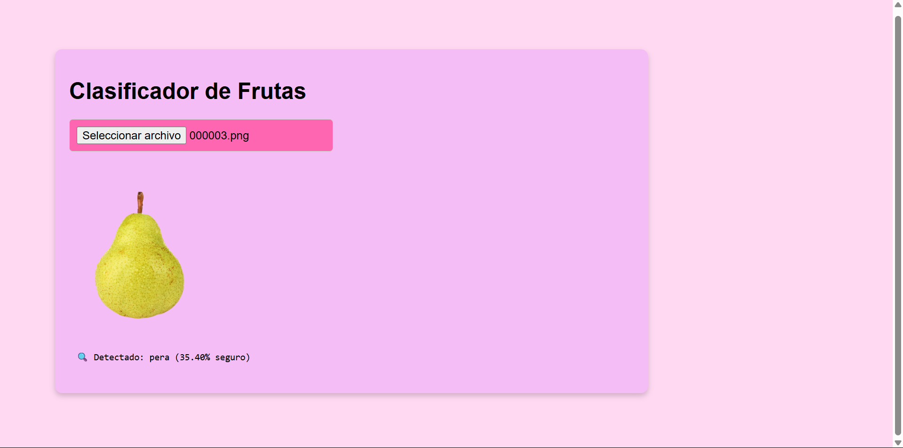

# Clasificador de Frutas con TensorFlow.js

Este proyecto permite entrenar y utilizar un modelo de red neuronal convolucional (CNN) directamente en el navegador para reconocer frutas a partir de imágenes.

## Requisitos

- Python 3.x
- Navegador moderno (Chrome recomendado)
- Node.js (opcional si querés correr un servidor local)
- TensorFlow.js (incluido vía CDN)

---

## 1. Descarga de Imágenes

Se utiliza un script en Python para descargar imágenes desde Google según las frutas especificadas:

### Script: `/programaEntrenar/traer-frutas.py`

## Instrucciones

1. Crear un entorno vitual (opcional pero recomendado)

```bash
python -m venv env
.env\Scripts\activate
```

2. Instalar la librería `icrawler`

```bash
pip install icrawler
```

3. Ejecutar el script

```bash
python traer-frutas.py
```

## 2. Entrenamiento del Modelo (HTML + JS)

Abrir `programaEntrenar/index.html` en el navegador y seguir estos pasos:

1. Seleccionar la carpeta frutas/ (que contiene subcarpetas como manzana, pera, etc.)

2. Hacer clic en Entrenar Modelo

3. Se mostrará el progreso por época
   

4. Descargar el modelo entrenado como `modelo-frutas.json` y `modelo-frutas.weights.bin` en la carpeta `/modeloDescargado`
   

## 3. Clasificacion con modelo entrenado Descargado

1. Abrir utilizarModelo/index.html en el navegador
2. Subir una imagen de fruta
3. Se mostrará la predicción
   

### Alumna: Miño Ailin
